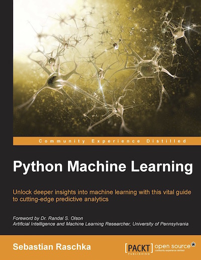

# python-machine-learning-book

*Python Machine Learning* code repository.

What you can expect are 400 pages rich in useful material just about everything you need to know to get started with machine learning ... from theory to the actual code that you can directly put into action! This is not yet just another "this is how scikit-learn works" book. I aim to explain all the underlying concepts, tell you everything you need to know in terms of best practices and caveats, and
we will put those concepts into action mainly using NumPy, scikit-learn, and Theano.

You are not sure if this book is for you? Please checkout the excerpts from the [Foreword](./docs/foreword_ro.pdf) and [Preface](./docs/preface_sr.pdf), or take a look at the [FAQ](#faq) section for further information.

---

1st edition, published September 23rd 2015 
Paperback: 454 pages 
Publisher: Packt Publishing   
Language: English 
ISBN-10: 1783555130   
ISBN-13: 978-1783555130 
Kindle ASIN: B00YSILNL0 

---
> *Sebastian Raschka’s new book, Python Machine Learning, has just been released. I got a chance to read a review copy and it’s just as I expected - really great! It’s well organized, super easy to follow, and it not only offers a good foundation for smart, non-experts, practitioners will get some ideas and learn new tricks here as well.*  
– Lon Riesberg at [Data Elixir](http://dataelixir.com/issues/55#start)

> *Superb job! Thus far, for me it seems to have hit the right balance of theory and practice…math and code!*   
– [Brian Thomas](http://sebastianraschka.com/blog/2015/writing-pymle.html#comment-2295668894)

> *I've read (virtually) every Machine Learning title based around Scikit-learn and this is hands-down the best one out there.*    
– [Jason Wolosonovich](https://www.linkedin.com/pulse/python-machine-learning-sebastian-raschka-review-jason-wolosonovich?trk=prof-post)

### [Feedback & Reviews](./docs/feedback.md)

## Links

- ebook and paperback at [Amazon.com](http://www.amazon.com/Python-Machine-Learning-Sebastian-Raschka/dp/1783555130/ref=sr_1_2?ie=UTF8&qid=1437754343&sr=8-2&keywords=python+machine+learning+essentials), [Amazon.co.uk](http://www.amazon.co.uk/Python-Machine-Learning-Sebastian-Raschka/dp/1783555130), [Amazon.de](http://www.amazon.de/s/ref=nb_sb_noss_2?__mk_de_DE=ÅMÅŽÕÑ&url=search-alias%3Daps&field-keywords=python+machine+learning)
- [ebook and paperback](https://www.packtpub.com/big-data-and-business-intelligence/python-machine-learning) from Packt (the publisher)
- at other book stores: [O'Reilly](http://shop.oreilly.com/product/9781783555130.do), [Safari](https://www.safaribooksonline.com/library/view/python-machine-learning/9781783555130/), [Barnes & Noble](http://www.barnesandnoble.com/w/python-machine-learning-essentials-sebastian-raschka/1121999969?ean=9781783555130), [Apple iBooks](https://itunes.apple.com/us/book/python-machine-learning/id1028207310?mt=11), ...
- free [sample chapter](http://www.slideshare.net/packtpub/python-machine-learning-sample-chapter)

### [Literature References & Further Reading Resources](./docs/references.md)

### [Image Gallery](./images/image_gallery/README.md)

### [Errata](./docs/errata.md)

## Table of Contents and Code Notebooks

Simply click on the `ipynb`/`nbviewer` links next to the chapter headlines to view the code examples (currently, the internal document links are only supported by the NbViewer version).
**Please note that these are just the code examples accompanying the book, which I uploaded for your convenience; be aware that these notebooks may not be useful without the formulae and descriptive text.**   

Excerpts from the [Foreword](./docs/foreword_ro.pdf) and [Preface](./docs/preface_sr.pdf)

1. Machine Learning - Giving Computers the Ability to Learn from Data [[dir](./code/ch01)] [[ipynb](./code/ch01/ch01.ipynb)] [[nbviewer](http://nbviewer.ipython.org/github/rasbt/python-machine-learning-book/blob/master/code/ch01/ch01.ipynb)]
2. Training Machine Learning Algorithms for Classification [[dir](./code/ch02)] [[ipynb](./code/ch02/ch02.ipynb)] [[nbviewer](http://nbviewer.ipython.org/github/rasbt/python-machine-learning-book/blob/master/code/ch02/ch02.ipynb)]
3. A Tour of Machine Learning Classifiers Using Scikit-Learn [[dir](./code/ch03)] [[ipynb](./code/ch03/ch03.ipynb)] [[nbviewer](http://nbviewer.ipython.org/github/rasbt/python-machine-learning-book/blob/master/code/ch03/ch03.ipynb)]
4. Building Good Training Sets – Data Pre-Processing [[dir](./code/ch04)] [[ipynb](./code/ch04/ch04.ipynb)] [[nbviewer](http://nbviewer.ipython.org/github/rasbt/python-machine-learning-book/blob/master/code/ch04/ch04.ipynb)]
5. Compressing Data via Dimensionality Reduction [[dir](./code/ch05)] [[ipynb](./code/ch05/ch05.ipynb)] [[nbviewer](http://nbviewer.ipython.org/github/rasbt/python-machine-learning-book/blob/master/code/ch05/ch05.ipynb)]
6. Learning Best Practices for Model Evaluation and Hyperparameter Optimization [[dir](./code/ch06)] [[ipynb](./code/ch06/ch06.ipynb)] [[nbviewer](http://nbviewer.ipython.org/github/rasbt/python-machine-learning-book/blob/master/code/ch06/ch06.ipynb)]
7. Combining Different Models for Ensemble Learning [[dir](./code/ch07)] [[ipynb](./code/ch07/ch07.ipynb)] [[nbviewer](http://nbviewer.ipython.org/github/rasbt/python-machine-learning-book/blob/master/code/ch07/ch07.ipynb)]
8. Applying Machine Learning to Sentiment Analysis [[dir](./code/ch08)] [[ipynb](./code/ch08/ch08.ipynb)] [[nbviewer](http://nbviewer.ipython.org/github/rasbt/python-machine-learning-book/blob/master/code/ch08/ch08.ipynb)]
9. Embedding a Machine Learning Model into a Web Application [[dir](./code/ch09)] [[ipynb](./code/ch09/ch09.ipynb)] [[nbviewer](http://nbviewer.ipython.org/github/rasbt/python-machine-learning-book/blob/master/code/ch09/ch09.ipynb)]
10. Predicting Continuous Target Variables with Regression Analysis [[dir](./code/ch10)] [[ipynb](./code/ch10/ch10.ipynb)] [[nbviewer](http://nbviewer.ipython.org/github/rasbt/python-machine-learning-book/blob/master/code/ch10/ch10.ipynb)]
11. Working with Unlabeled Data – Clustering Analysis [[dir](./code/ch11)] [[ipynb](./code/ch11/ch11.ipynb)] [[nbviewer](http://nbviewer.ipython.org/github/rasbt/python-machine-learning-book/blob/master/code/ch11/ch11.ipynb)]
12. Training Artificial Neural Networks for Image Recognition [[dir](./code/ch12)] [[ipynb](./code/ch12/ch12.ipynb)] [[nbviewer](http://nbviewer.ipython.org/github/rasbt/python-machine-learning-book/blob/master/code/ch12/ch12.ipynb)]
13. Parallelizing Neural Network Training via Theano [[dir](./code/ch13)] [[ipynb](./code/ch13/ch13.ipynb)] [[nbviewer](http://nbviewer.ipython.org/github/rasbt/python-machine-learning-book/blob/master/code/ch13/ch13.ipynb)]

## FAQ

### Questions about ML Concepts

- [Why do we re-use parameters from the training set to standardize the test set and new data?](./faq/standardize-param-reuse.md)
- [What are some of the issues with clustering?](./faq/issues_with_clustering.md)
- [What is the difference between deep learning and usual machine learning?](./faq/difference_deep_and_normal_learning.md)
- [What is the best validation metric for multi-class classification?](./faq/multiclass-metric.md)
- [What are differences in research nature between the two fields: machine learning & data mining?](./faq/datamining-vs-ml.md)
- [How do I know if the problem is solvable through machine learning?](./faq/ml-solvable.md)
- [What factors should I consider when choosing a predictive model technique?](./faq/choosing-technique.md)
- [Does regularization in logistic regression always results in better fit and better generalization?](./faq/regularized-logistic-regression-performance.md)
- [How was classification, as a learning machine, developed?](./faq/classifier-history.md)
- [What are some good books/papers for learning deep learning?](./faq/deep-learning-resources.md)
- [What are the different dimensionality reduction methods in machine learning?](./faq/dimensionality-reduction.md)

### Questions about the Book

- [Can I use paragraphs and images from the book in presentations or my blog?](./faq/copyright.md)
- [How is this different from other machine learning books?](./faq/different.md)
- [Which version of Python was used in the code examples?](./faq/py2py3.md)
- [Which technologies and libraries are being used?](./faq/technologies.md)
- [Which book version/format would you recommend?](./faq/version.md)
- [Why did you choose Python for machine learning?](./faq/why_python.md)
- [Why do you use so many leading and trailing underscores in the code examples?](./faq/underscore_convention.md)
- [Are there any prerequisites and recommended pre-readings?](./faq/prerequisites.md)

### General Questions

- [What learning path/discipline in data science I should focus on?](./faq/data_science_career.md)
- [At what point should one start contributing to open source?](./open-source.md)
- [How important do you think having a mentor is to the learning process?](./mentor.md)
- [Where are the best online communities centered around data science/machine learning or python?](./ml-python-communities.md)

## Contact

I am happy to answer questions! Just write me an [email](mailto:mail@sebastianraschka.com)
or consider asking the question on the [Google Groups Email List](https://groups.google.com/forum/#!forum/python-machine-learning-book).

If you are interested in keeping in touch, I have quite a lively twitter stream ([@rasbt](https://twitter.com/rasbt)) all about data science and machine learning. I also maintain a [blog](http://sebastianraschka.com/articles.html) where I post all of the things I am particularly excited about.
