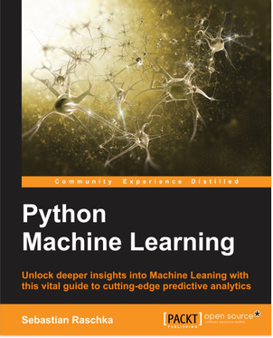

# python-machine-learning-book

*Python Machine Learning* code repository.

*Python Machine Learning* is in its final stages, and I am going to upload the accompanying code examples here
very soon. If everything goes as smoothly as planned, the estimated publication date would September 1-3.

## Links

- [ebook and paperback](http://www.amazon.com/Python-Machine-Learning-Sebastian-Raschka/dp/1783555130/ref=sr_1_2?ie=UTF8&qid=1437754343&sr=8-2&keywords=python+machine+learning+essentials) at Amazon
- [ebook and paperback](https://www.packtpub.com/big-data-and-business-intelligence/python-machine-learning) directly from the publisher

## Contact

I am happy to answer questions! Just write me an [email](mailto:mail@sebastianraschka.com)
or consider asking the question on the [Google Groups Email List](https://groups.google.com/forum/#!forum/python-machine-learning-book).

## Table of Contents

1. Machine Learning - Giving Computers the Ability to Learn from Data
2. Training Simple Machine Learning Algorithms for Classification
3. A Tour of Advanced Machine Learning Classifiers Using Scikit-Learn
4. Building Good Training Sets – Data Pre-Processing
5. Compressing Data via Dimensionality Reduction
6. Learning Best Practices for Model Evaluation and Hyperparameter Optimization
7. Combining Different Models for Ensemble Learning
8. Applying Machine Learning to Sentiment Analysis
9. Embedding a Machine Learning Model into a Web Application
10. Predicting Continuous Target Variables with Regression Analysis
11. Working with Unlabeled Data – Clustering Analysis  
12. Training Artificial Neural Networks for Image Recognition
13. Parallelizing Neural Network Training via Theano and PyLearn2

## IPython Notebooks

- COMING SOONG
